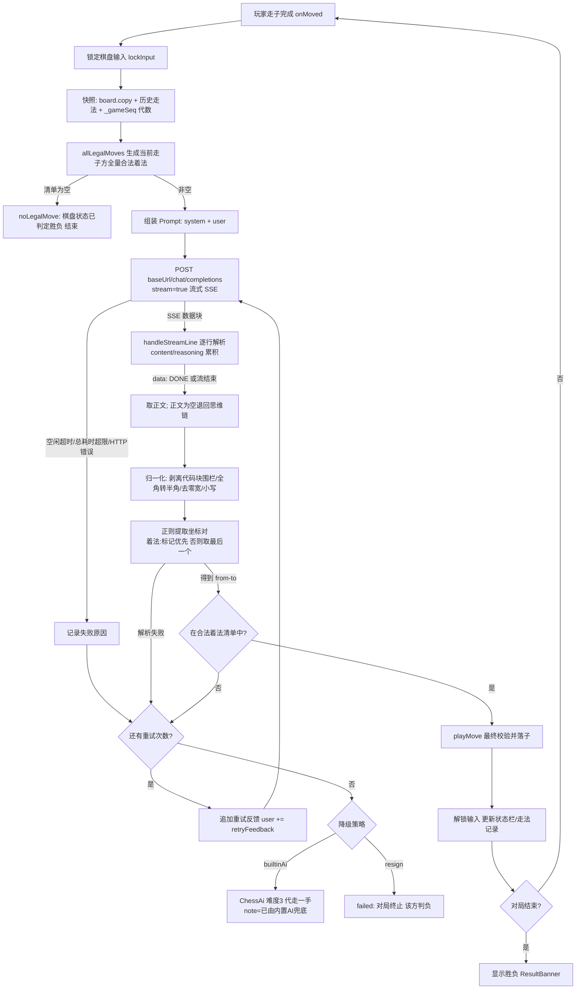
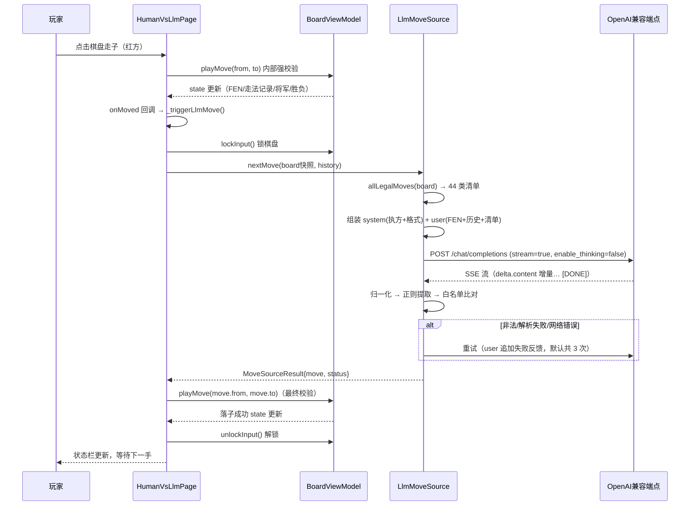

# 大模型对弈交互流程说明（人 vs LLM）

> 配套 `task_v3.md`。描述客户端与 OpenAI 兼容端点每手棋的完整交互、
> 请求/响应数据格式、提示词约束与返回处理管线。

## 1. 流程图（单手棋的决策管线）



## 2. 交互时序图（人 vs LLM 一手棋）



## 3. 客户端发送的数据格式

HTTP 请求（每手一次）：

```http
POST {baseUrl}/chat/completions
Content-Type: application/json
Accept: text/event-stream
Authorization: Bearer {apiKey}        # Key 非空时才携带

{
  "model": "{用户配置的模型 ID}",
  "messages": [
    { "role": "system", "content": "{§4.1}" },
    { "role": "user",   "content": "{§4.2}" }
  ],
  "temperature": 0.3,
  "max_tokens": 4096,
  "stream": true,
  "enable_thinking": false            # 仅当 disableThinking=true（默认）
}
```

要点：
- **流式 SSE**：超时为"空闲超时"（两次数据块最大间隔，默认 60s 可配 30-300s），
  总耗时上限 = 空闲超时 × 4；模型持续吐字不会被误判。
- **max_tokens=4096**：即使思维链被禁用，也给非思考型模型留足余量。
- **enable_thinking=false 默认发送**：下棋只需要一个着法，思维链只会拖慢响应；
  配置卡开关"禁用思维链（推荐）"默认开启，仅观察推理时才关闭。
- Key 只进 Authorization 头（来自 flutter_secure_storage），不落日志。

## 4. 提示词约束

### 4.1 system（每次请求相同，仅执方不同）

```text
你是中国象棋对弈引擎的着法接口，本局执红方。
坐标约定：列用字母 a-i（从左到右），行用数字 0-9（0 为黑方底线、棋盘顶部，9 为红方底线、棋盘底部）。
你只能从用户提供的「合法着法清单」中选择一步，禁止编造清单之外的着法。

【回复格式（唯一允许的格式，违反即视为无效）】
整个回复只包含一行，形式为：
着法: 起点-终点
示例：着法: b2-e2

禁止输出：任何解释、推理过程、心理活动、道歉、开场白、markdown、代码块、引号、多行文本。
你的回复将被程序逐字解析，任何多余字符都会导致这步棋作废。
```

约束设计：单行格式（无"思路"行，减少解析面）、着法必须是"从清单选择"而非"自由生成"
（规避 Xiangqi-R1 论文实证的合法率问题）、明确"程序逐字解析"的后果感。

### 4.2 user（每手动态组装）

```text
【当前局面 FEN】rnbakabnr/9/1c5c1/p1p1p1p1p/9/9/P1P1P1P1P/1C5C1/9/RNBAKABNR w - - 0 1
【轮走方】红方（该方是你）
【最近着法（中文记法，最新在最后）】炮二平五  马8进7  （最多最近 12 手）
【合法着法清单（共 44 条，必须从中选择一条）】
a6-a5, a9-a7, …, i9-i8
【输出】仅一行，格式：着法: 起点-终点（起点与终点均取自上方清单）
```

坐标即清单语言：清单条目与期望输出同构（`b2-e2`），模型只需"复制"不需"换算"，
这是合法率的第一道保障。

### 4.3 重试反馈（解析/校验失败时追加到 user 末尾）

```text
你上一次的回复无效（着法 b2-x9 不在合法清单中）。请重新回答：
整个回复只含一行「着法: 起点-终点」，着法必须取自合法着法清单，不要输出任何其他文字。
```

## 5. 返回数据的处理管线（客户端"进一步处理"）

按顺序五层过滤，任一层失败即进入重试/降级：

| 层 | 处理 | 失败去向 |
|---|---|---|
| 1. 流重组 | SSE 逐行解析：`data:` 行取 JSON delta，累积 `content` 与 `reasoning_content`；跳过空行/注释心跳/非 JSON 行；`[DONE]` 结束；含 `error` 字段即抛错 | 网络层错误 → 重试 |
| 2. 文本提取 | 正文为空（思考型 token 耗尽）时退回思维链文本尽力提取 | — |
| 3. 归一化 | 剥离 ``` 围栏、全角→半角、去零宽字符/BOM、转小写 | — |
| 4. 着法提取 | 正则 `([a-i])(\d)[-–—~到至]?([a-i])(\d)`；「着法:」标记优先，否则取最后一个坐标对；范围外（j 列/10 行）判无效 | 解析失败 → 重试 |
| 5. 白名单校验 | 提取结果必须与本地 `allLegalMoves` 生成的清单**精确匹配**（本地规则是唯一事实源） | 不在清单 → 重试 |

重试耗尽（默认 3 次）后按对局设置降级：`builtinAi`（内置 AI 难度 3 代走一手并标注）
或 `resign`（该方判负、对局终止）。页面侧 `playMove` 还保留第六层最终校验（双保险）。

## 6. 失败模式与表现对照

| 失败模式 | 状态栏表现 | 结果 |
|---|---|---|
| 端点/Key/模型未配置 | "模型端点未配置" | 重试耗尽 → 降级 |
| 思维链未禁用且太慢 | "空闲超时/总耗时超限" | 重试耗尽 → 降级 |
| 模型输出多余解释 | 重试（附失败原因反馈） | 多数在第 2 次成功 |
| 模型坚持编造着法 | 重试 3 次 → "已由内置 AI 兜底走子" | 对局继续 |
| 端点 4xx/5xx | "HTTP xxx: 响应摘要" | 重试耗尽 → 降级 |
| resign 策略下重试耗尽 | "该方走子失败，按判负处理" | 对局终止 |
