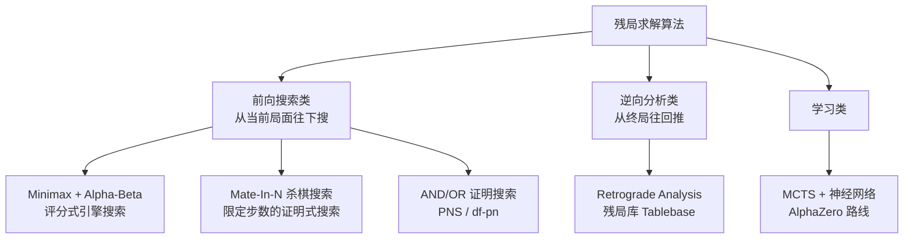
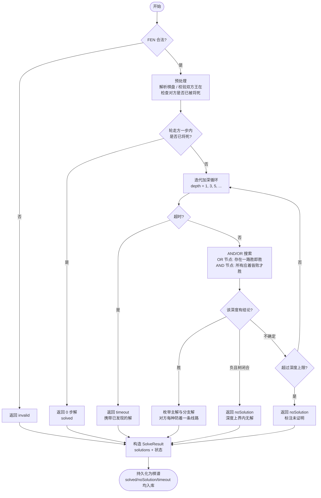
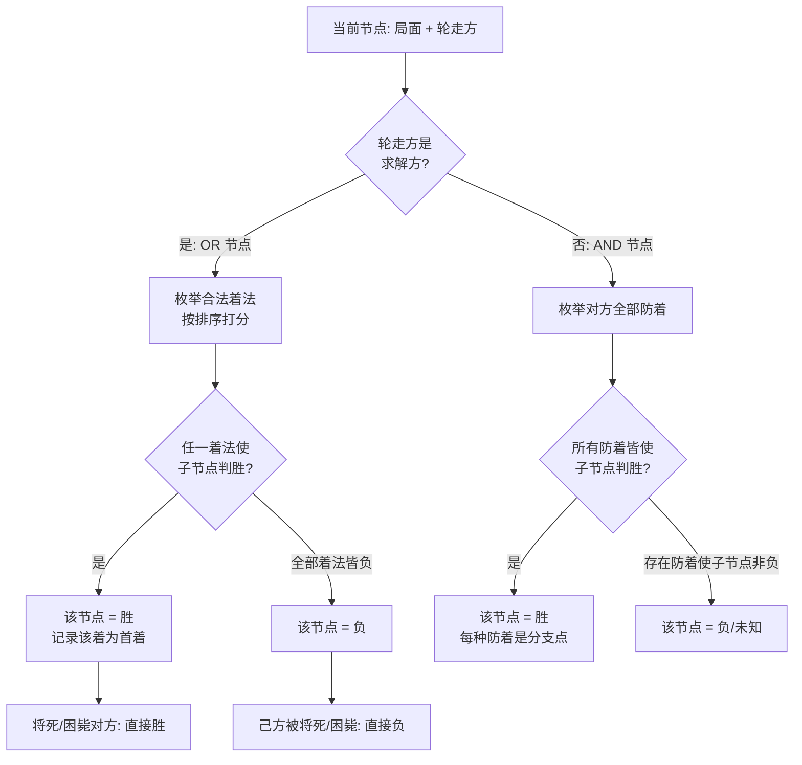
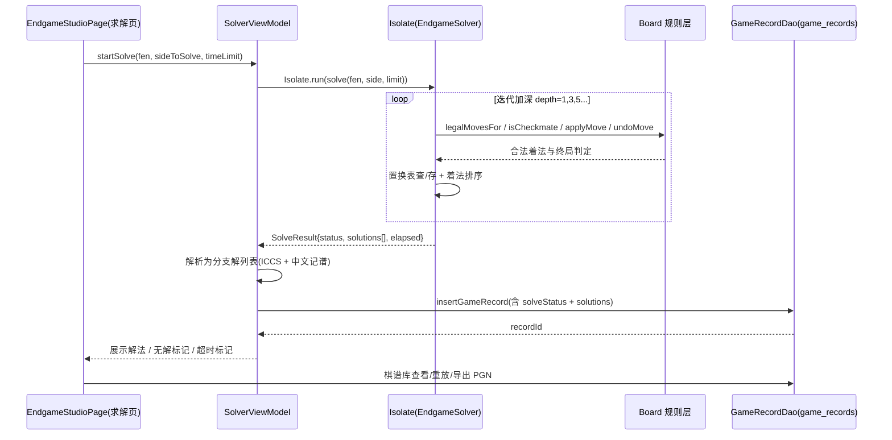
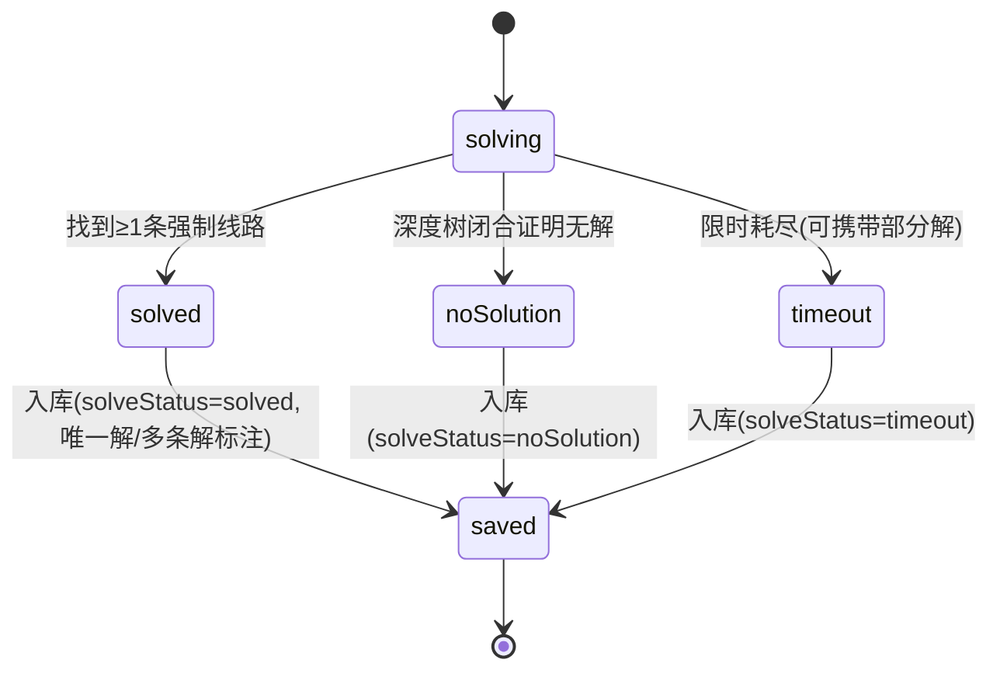

# 第四阶段调研（一）：中国象棋残局求解算法对比与本项目求解器设计

> 调研范围：残局/排局"求破解之法"的主流算法族，优缺点、适用场景与本项目（Flutter + 纯 Dart 规则引擎）的适配结论。文末给出本项目求解器的完整设计（含 mermaid 流程图与数据交互图）。

## 1. 问题定义

"残局破解"在博弈论意义上是一个**证明问题**而非**评分问题**：给定局面 FEN 与行棋方，回答——

1. 行棋方是否存在**必胜策略**（通常是"N 步内将死对方"的杀局）？
2. 若存在，给出**主解**（每一步都不可替换的强制线路）；
3. 对手在不同防着下的**分支解**（多条破解走法）分别是什么？
4. 若不存在（在给定深度内），给出**无解证明**或标注"限时未决"。

这与普通引擎"找一步好棋"（评分最大化）本质不同：求解器要证明"**所有**分支都必败"，评分器只要证明"这一支更好"。

## 2. 算法族谱与对比矩阵

### 2.1 对比矩阵

| 算法 | 原理 | 复杂度/资源 | 优点 | 缺点 | 适用场景 | 本项目适配度 |
|---|---|---|---|---|---|---|
| Minimax + Alpha-Beta | 双方最优假设下递归评估，剪枝无效分支 | O(b^(d/2))（良好排序时）；需评估函数 | 工程成熟；可下全局棋；现有 `ChessAi` 已实现 | 只能给"最好一步"，**无法证明必胜/无解**；深度受算力限制 | 人机对弈、局势判断 | ★★★ 已有，作为兜底与验证器 |
| Mate-In-N 杀棋搜索 | 在 AND/OR 语义上做迭代加深，只搜"将死"目标，评估函数换成 | prove/refute | 指数级但常数小；天然输出"第 N 步杀" | 只对杀局有效；需要专用评估（不能复用子力分） | 象棋排局、连杀题 | ★★★★ 本项目求解器内核 |
| PNS（Proof-Number Search） | best-first AND/OR 树，按"证明数/反证数"扩张最有望节点 | 内存占用大（存全树）；节点数常远小于深度优先 | 求证能力最强；对"证真/证伪"不对称局面极有效 | 实现复杂；内存不可控；移动端不友好 | 理论完备性证明、排局验证 | ★★ 采用其思想（AND/OR 语义）但用迭代加深实现 |
| df-pn（depth-first PNS） | 用置换表模拟 best-first，内存可控 | 内存 O(表大小) | 兼顾证明能力与内存 | 实现最复杂；阈值维护易出错 | 强求解器（将棋类主流） | ★★ 记为后续演进方向 |
| Retrograde Analysis（逆向分析/残局库） | 从终局集合出发反向枚举，迭代标注所有局面胜负 | 状态空间爆炸：每加一个子约 ×90 | 一旦生成，查询 O(1) 且**绝对精确**（含唯一性判定） | 必须按"子型子数"预生成库文件（几十 MB～GB）；边界：子数≤4~5 | 精确残局（单车、马炮类定式） | ★★ 本期不内置库文件；调研给出后续路线 |
| MCTS + NN（AlphaZero 类） | 自我对弈训练策略/价值网络指导搜索 | 需 GPU 训练 + 推理运行时 | 全局棋力最强 | 无法给出严格证明；训练成本高；移动端集成重 | 对弈引擎 | ★ 不适配"证明"需求 |

### 2.2 关键结论

1. **评分式引擎不能当求解器用**：Alpha-Beta 输出"分高的一步"，对"是否存在必胜""解是否唯一"没有保证——同一局面不同搜索深度可能给出不同"最佳"，且永远无法回答"无解"。
2. **本项目落地方案：迭代加深 AND/OR 杀棋搜索**（Mate-In-N 的中国象棋版）——
   - AND/OR 语义直接回答"证明"问题：己方节点是 **OR**（存在一路胜即胜），对方节点是 **AND**（所有应着皆败才算胜）；
   - 迭代加深（深度 1,3,5,…递增，按"回合"计）保证：能在限时内先给出**浅杀**，超时则返回 `timeout` + 已发现的解；深度闭合（对方所有防着都被证明失败且无新着）则给出**无解证明**（在深度上界内）；
   - 纯 Dart、复用现有 `Board` 规则层（合法走法/将军/将死/困毙），加置换表与着法排序后，残局场景（子少、分支小）在手机算力内可解 10 步（5 回合）上下的杀局。
3. **多解枚举的语义**（必须先定义清楚，否则"所有破解之法"无界）：
   - 一条**解** = 一条主变着法序列（求解方每步都走"证明胜"的着，应对方走其"最强防着"之一）；
   - 解的分支只发生在**应对方的应着**分叉处：对方有多种防着时，对每一种防着给出后续强制线路；
   - **去重**：同一 (局面, 求解方) 的重复线路合并；求解方"换一步同样必胜的着"不视为新解（那会组合爆炸），只在 UI 提供"替换着法"提示。
   - 这样解的数量 = 对方防着树的剪枝形态，通常 1～10 条，可枚举。
4. **长将/长捉规则**：中国象棋禁止长将（循环判负）。本项目 `Board` 层未实现循环检测，求解器以"重复局面 3 次判和"近似处理（在杀局求解语义下，求解方路径含重复局面即剪枝），完整长将判定记为已知限制。

## 3. 本项目求解器设计

### 3.1 求解主流程

### 3.2 AND/OR 节点判定

### 3.3 数据交互图（UI ⇄ Isolate ⇄ 规则层 ⇄ 存储）

### 3.4 求解状态机（对应棋谱入库标记）

## 4. 参考资料清单

- 象棋百科（xqbase）残局库篇——逆向分析生成残局库的中文最系统资料：https://www.xqbase.com/computer/other_egtb.htm
- Chess Programming Wiki：Proof-Number Search（https://chessprogramming.org/Proof-Number_Search ）、Mate Search（https://chessprogramming.org/Mate_Search ）
- Winands, *Proof-Number Search and its Variants*（df-pn 权威综述）：https://dke.maastrichtuniversity.nl/m.winands/documents/pnchapter.pdf
- Schadd, *Proof-Number Search with Endgame Databases*（PNS+残局库混合）：http://www.schadd.com/Thesis/Proof-Number%20Search%20with%20Endgame%20Databases.pdf
- Sipper et al., *Evolution of an Efficient Search Algorithm for the Mate-In-N Problem*：https://www.moshesipper.com/pubs/efficient_search.pdf
- 逢甲大学《象棋残局回溯分析演算法之实作与评估》：http://dspace.fcu.edu.tw/handle/2377/2794
- Wikipedia: Retrograde analysis：https://en.wikipedia.org/wiki/Retrograde_analysis

## 5. 后续演进路线（不在本期）

1. **df-pn 变体**：把迭代加深 AND/OR 换成 df-pn，用置换表控内存，求解深度上限可再翻倍。
2. **残局库**：对 ≤3 子局面（如 单车vs士象全）离线生成 retrograde 库文件随 App 分发，查询即得精确解与唯一性。
3. **Pikafish 桥接**：`pikafish_bridge.dart` 真实接入 UCI 引擎（`go mate N`），作为强算力验证器；其"多解枚举"仍需本项目求解器补齐。
