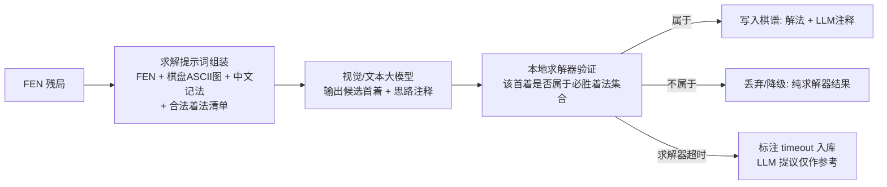
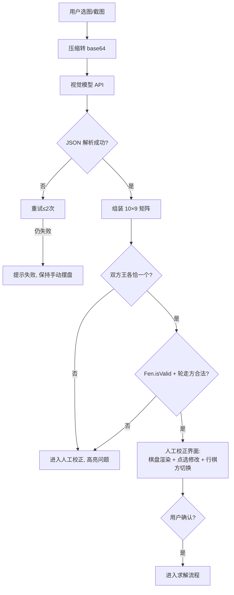

# 第四阶段调研（二）：大模型求解棋局的框架与提示词方案 + AI 识图导入棋局

> 目标：以**最快集成**为原则，调研用 LLM 辅助"残局破解"的框架/提示词方案，以及"棋盘图片 → 标准坐标"的识图路线；两者均直接落到本项目的现有 LLM 接入体系（OpenAI 兼容 `/chat/completions` + flutter_secure_storage 密钥）之上。

## 1. 现有接入基础（本项目三期已具备）

| 能力 | 现状 | 复用点 |
|---|---|---|
| OpenAI 兼容调用 | `LlmMoveSource`（http 包，流式 SSE，空闲超时+总上限，重试+降级） | 识图与求解提示新增请求复用同一配置结构 `LlmConfig` |
| 密钥安全存储 | `LlmConfigStore`（flutter_secure_storage，红/黑双槽位） | 新增视觉模型配置槽位 `llm_config_vision`，同样走 secure storage |
| 端点预设 | `LlmPreset.all`（智谱/DeepSeek/Kimi/OpenRouter/OpenAI/自定义） | 视觉模型预设沿用同一 baseUrl 列表，示例模型换多模态型号 |
| Prompt 协议 | `LlmPrompts`：FEN + 中文记法 + **完整合法着法清单**，模型只"提议"，本地规则裁决 | 求解提示词直接沿用该协议（这是本项目最关键的可靠性设计） |

> 密钥纪律：API Key 一律经设置界面录入 secure storage（或环境变量注入 CI），**源码、示例、测试、文档均不得出现可用凭据字面量**。

## 2. LLM 求解棋局：基准结论与框架调研

### 2.1 可靠性基准结论（决定架构）

- LLM Chess 基准（arXiv 2512.01992 与 maxim-saplin/llm_chess）测试了十余个模型完整对弈：**不提供合法着法清单与棋盘状态时，模型走非法着与"幻觉子"的比例很高**；提供 FEN + 合法清单后明显改善，但仍远弱于引擎。
- 结论：**LLM 不能充当求解器**（无法证明必胜/无解），只能充当**启发式提议者**。本项目三期"模型提议 + 本地规则裁决"的协议已被验证可行，四期沿用并升级为"模型提议 + 求解器验证"。

### 2.2 可借鉴的框架/推理模式对比

| 框架/模式 | 思路 | 集成成本 | 适配结论 |
|---|---|---|---|
| 合法清单约束（本项目已有） | Prompt 附完整合法着法，模型只许从中选 | 已集成 | 保留为所有 LLM 交互的底座 |
| ReAct（工具调用循环） | 模型多轮"思考→调用工具（走法/评估）→观察" | 中：需实现工具循环 | 本期不做交互循环，用"单轮提议+程序验证"近似 |
| ReTA（递归前瞻 + Self-Consistent CoT） | 模型显式向前推演 N 步再回答 | 低（提示词即可） | **采纳**：求解提示词要求模型先列"候选招法与理由"再给首着 |
| Self-Consistency 投票 | 同一问题采样 k 次取众数 | 低-中（k 次调用费用） | **可选采纳**：LLM 辅助模式默认 3 次投票，票数不一致则不采纳 |
| 多 Agent 辩论 / AutoGen 对话棋 | 多个 Agent 对话互相挑战 | 高（多模型编排） | 不采纳：费用与时延不匹配收益 |
| 混合架构（Hybrid） | LLM 出候选首着/思路注释，**确定性求解器验证后才写入棋谱** | 低 | **采纳为本期方案** |

### 2.3 本期落地：Hybrid 求解架构



要点：LLM 的任何输出**不直接进棋谱**，只有被 `EndgameSolver` 证明为"必胜着法"的首着及其后续强制线路才入库；LLM 提供的是**思路注释**（人类研究价值）与**着法排序启发**（加速求解）。

### 2.4 可直接抄用的提示词模板（已在本期实现于 `LlmSolvePrompts`）

**System（求解辅助）：**

```text
你是中国象棋残局研究助手，协助分析一个残局。
坐标约定：列 a-i（从左到右），行 0-9（0 为黑方底线/棋盘顶部，9 为红方底线/棋盘底部）。
你只能从「合法着法清单」中选择首着，禁止编造清单之外的着法。
回复格式（严格遵守，共三行）：
首选着法: 起点-终点
备选着法: 起点-终点（可写 无）
思路: 一句话说明攻击目标与关键点
禁止输出其他任何内容。
```

**User（组装函数 `LlmSolvePrompts.buildUser(board)`）：**

```text
【局面 FEN】<board.toFen()>
【棋盘图（大写红方/小写黑方，第一行是黑方底线）】
<board.ascii()>   ← 10 行文本图，行号 0-9、列号 a-i 标注
【轮走方】红方（求解方）
【任务】判断该局面求解方是否有强制将死的杀法；若有，给出首选首着与备选首着（均取自合法着法清单）。
【合法着法清单（共 N 条）】h2e2, h2g4, ...
```

**解析容错**：复用 `LlmMoveParser.extract` 的归一化（剥代码块、全角转半角、取"首选着法:"标记后的坐标对），解析失败重试最多 2 次后降级为纯求解器模式。

### 2.5 API Key 配置指引（面向用户）

1. 应用内：对局/求解页 → 模型配置卡 → 选择预设端点（如智谱 GLM）→ 填入模型 ID 与 API Key（Key 只进 flutter_secure_storage，Windows 走 DPAPI 加密，不落明文）。
2. 支持多模态识图的推荐型号（预设示例，均为公开模型 ID，无凭据）：`glm-4.5v`、`glm-4v-flash`（智谱）；`gpt-4o-mini`（OpenAI）；`openai/gpt-4o-mini`（OpenRouter 聚合）。
3. CI/自动化场景：从环境变量读取（如 `LLM_API_KEY`），不写入仓库。

## 3. AI 识图：棋盘图片 → 标准坐标

### 3.1 两条路线对比

| 维度 | 路线 A：多模态大模型 API（**本期采用**） | 路线 B：本地 CV/OCR |
|---|---|---|
| 原理 | 图片 base64 → vision 模型输出棋盘 10×9 布局 → 转换为 FEN | 定位棋盘 → 透视校正 → 网格切分 → 棋子检测/汉字分类 → FEN |
| 代表项目 | OpenAI GPT-4o/智谱 GLM-4.5V 等通用视觉模型 | nrl-ai/chessai（象棋，CV+DL 完整开源）、CVChess、chessimg2pos、Stanford EE368 象棋识别报告 |
| 集成成本 | 极低：http 多模态请求，无需原生依赖/模型文件 | 高：OpenCV/PyTorch 原生依赖、训练或内置模型、Flutter 平台通道 |
| 准确率 | 依赖所选模型；棋类盘面（俯拍/截图）通常较好，真实照片透视/光照差时易错 | 截图类准确；照片类取决于模型质量 |
| 可控性 | 无法微调；输出需校验 | 可针对自家棋盘风格训练 |
| 兜底 | **必须有人工校正界面**（本期已设计） | 同样需要校正界面 |

**结论**：本项目不引原生 CV 依赖，走路线 A（多模态 LLM），并在流程上强制"识图结果 → 合法性校验 → 可视化人工校正 → 确认入库"，把模型错误拦在人工环节。路线 B 记为后续路线（见 §3.4）。

### 3.2 识图请求设计

- 请求体（OpenAI 兼容多模态格式，非流式 JSON，新增于 `VisionBoardReader`）：

```json
{
  "model": "<视觉模型 ID，取自视觉配置槽位>",
  "messages": [
    { "role": "system", "content": "你是棋盘识别器，只输出 JSON。" },
    { "role": "user", "content": [
      { "type": "image_url", "image_url": { "url": "data:image/png;base64,<...>" } },
      { "type": "text", "text": "<识图提示词>" }
    ]}
  ],
  "temperature": 0.1,
  "max_tokens": 4096,
  "enable_thinking": false
}
```

> **性能实测（2026-10，qwen3.8-max）**：思维链默认开启时识图请求耗时 61~115s（completion_tokens 3000~4600 全部是思考 token），60s 超时必然失败；带上 `enable_thinking: false` 后降至 **6~14s**。因此识图请求默认携带该参数（复用 `LlmConfig.disableThinking` 开关），请求超时默认 120s，超时报错翻译为可操作提示。

- **识图提示词**（要求输出可校验的 JSON，而非自由文本）：

```text
识别图中中国象棋棋盘。以 JSON 回复，不要输出其他文字：
{"turn":"red|black","pieces":[{"col":"a-i","row":"0-9","piece":"R|N|B|A|K|C|P(红大写)/r|n|b|a|k|c|p(黑小写)"}]}
行 0 为棋盘顶部（黑方底线），行 9 为底部（红方底线）。只列实际出现的棋子。
```

- **校验管线**（识别结果绝不能直接信）：



### 3.3 错误模式与校正兜底

| 模型错误模式 | 校验/兜底手段 |
|---|---|
| 漏识别棋子（尤其兵/士/象等小字） | 人工校正界面逐格可改；识别结果与"双方王各一"硬校验 |
| 透视照片行列错位 | 提示用户优先使用截图/正俯拍；校正界面直接改格 |
| 红黑混淆（红字繁简/草写） | FEN 硬校验 + 校正界面棋子选择器按红黑分区 |
| 输出多余文本/JSON 坏损 | JSON 严格解析 + 重试 2 次 → 失败降级手动摆盘 |

### 3.4 本地 CV 后续路线（评估备查）

若未来要离线识图：nrl-ai/chessai（Apache-2.0，含棋盘检测+棋子识别）可作为参考实现；管线为"棋盘四角定位 → 单应性变换俯视 → 90 格切分 → CNN 分类（14 类棋子+空格）"。Flutter 侧需平台通道或 tflite 集成，成本高，仅在"离线/高频识图"成为刚需时立项。

## 4. 参考资料

- LLM Chess 基准：https://arxiv.org/html/2512.01992v1 ；llm_chess：https://github.com/maxim-saplin/llm_chess
- ReTA（递归前瞻 + 自洽思维链，NAACL 2024）：https://aclanthology.org/2024.naacl-long.123.pdf
- 提示词约束合法走法的实践：https://medium.com/@martinsurynek/ai-challenge-1-teaching-an-llm-to-play-chess-part-i-6e7090511727
- nrl-ai/chessai（象棋 CV 识别开源）：https://github.com/nrl-ai/chessai
- CVChess（棋盘图→FEN 深度学习框架）：https://arxiv.org/html/2511.11522v2
- Determining Chess Game State From an Image（arXiv 2104.14963）：https://arxiv.org/abs/2104.14963
- Stanford EE368 中国象棋状态识别：https://web.stanford.edu/class/ee368/Project_Autumn_1516/Reports/Yu.pdf
