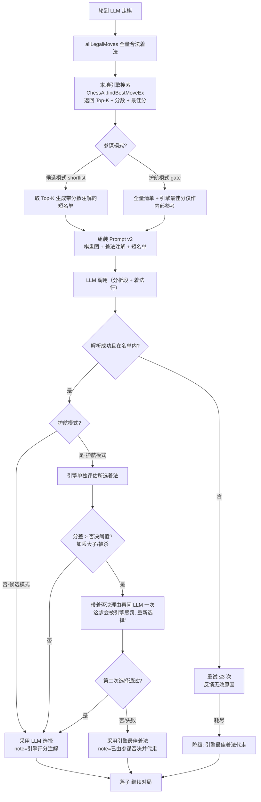

# LLM 棋力修复实现方案设计（待人工审核，未编码）

> 阶段：五期（LLM 棋力提升）· 报告 02
> 日期：2026-10-02
> 前置：`docs/phase5/01-problem-analysis-and-survey.md`
> 状态：**设计稿——等待审核通过后再进入编码**

---

## 0. 方案总览

三层递进，每层独立可验收、可回退：

| 层级 | 名称 | 一句话 | 新增依赖 | 预期棋力变化 |
|---|---|---|---|---|
| **P0** | Prompt v2 表示与协议修复 | 让模型"看得懂棋盘、看得懂着法、能思考" | 无 | 消除大量低级失误；仍弱于内置 AI 高难度 |
| **P1** | 引擎参谋制（核心方案） | 每手棋本地引擎先算，LLM 在"受护航/候选名单"约束下拍板 | 无（复用 `ChessAi`） | 棋力 ≈ 内置 AI 水平且**可调**；LLM 保留策略/风格决策权 |
| **P2** | 增强选项 | Self-consistency 投票；逐手引擎评分注解进 Prompt | 无（P2a 每手 k 次 API 调用） | 稳定性/质量再提升 |

P0/P1/P2 全部基于现有 `MoveSource` 抽象扩展，不改动对局页面协议；Pikafish 桥（`pikafish_bridge.dart` 目前是 TODO 空壳）**不**纳入本期——统一用纯 Dart 的 `ChessAi`，避免引入引擎二进制分发问题（Pikafish 接入可作为后续独立课题）。

---

## 1. P0：Prompt v2 —— 表示层与协议层修复

### 1.1 改动点

1. **user prompt 增加 ASCII 棋盘图**：复用 `llm_solve_assist.dart:42-54` 的 `_asciiBoard`，提升为共享工具函数。
2. **合法清单逐条标注**：`b2-e2(炮二平五,吃卒,将军)`——起点棋子、中文记法、是否吃子（含被吃子名）、走完后是否将军对方。标注信息全部由本地规则引擎生成，零成本、零幻觉。
3. **放开思考、结构化输出**：系统提示从"只准一行"改为"先输出 `分析:` 段（≤150 字），最后一行输出 `着法: 起点-终点`"。解析器 `LlmMoveParser.extract` 本就优先取「着法:」标记之后的坐标（`llm_move_source.dart:87-108`），天然兼容。
   - `disableThinking` 语义调整：开启时不发送 `enable_thinking:false`，改为**提示词内控制**（让模型在正文里体现分析），避免推理型模型被硬掐思维链。
4. **max_tokens 4096 → 8192**（思考型模型思维链 + 正文预算）。
5. **历史扩到整局中文记法**（超 60 步再截断），并附"重复局面警示"（本地检测三次重复类局面时注入提示）。
6. **重试反馈升级**：非法时不仅贴清单，还回显"你上次给的 `X-Y` 为何无效"。

### 1.2 新 Prompt 骨架（示意）

```
【当前局面 FEN】rnbakabnr/9/1c5c1/p1p1p1p1p/9/...  w
【棋盘图】
    a b c d e f g h i
 9  r n b a k a b n r
 8  . . . . . . . . .
 ...
 0  . . . . . . . . .
【轮走方】红方（该方是你）
【最近着法】炮二平五  马8进7  ...
【合法着法清单（共 N 条，必须从中选择一条）】
h2-e2(炮二平五,吃卒)  h0-g2(马二进三)  ...
【输出格式】
分析: 一两句话说明你的计划
着法: 起点-终点
```

### 1.3 验收标准（P0）

- 同一测试局面集（含 10 个"存在明显好着"的局面）上，P0 模型命中"引擎最佳着法 Top3"的比例显著高于现状基线；
- 非法着法率不升高；每手延迟增量 ≤ 30%（max_tokens 加倍在流式下影响有限）。

---

## 2. P1：引擎参谋制 —— 核心方案

### 2.1 设计思想

调研共识（报告 01 §3.2）：**LLM 用引擎，而不是代替引擎**。本项目引擎（`ChessAi`，纯 Dart、Isolate 安全）每手棋毫秒~秒级即可完成深度 6 搜索，把它作为"参谋"插入 LLM 决策回路：

- **引擎不算完**：引擎只负责"算分数、给名单"，最终走哪步由 LLM 决定（保留大模型对战的意义：策略、风格、名字就是模型本身）；
- **引擎兜住底线**：LLM 的选择若造成致命失分，参谋有权拦截。

### 2.2 两种参谋模式（用户可配）

| 模式 | 数据流 | LLM 的决策空间 | 适用场景 |
|---|---|---|---|
| **候选模式**（shortlist） | 引擎返回 Top-K 着法+分数 → Prompt 只给这 K 条（附分数分桶文字）→ LLM 从 K 中选 1 | K 选 1（K=3~8） | "LLM 棋手"仍要下棋，但只在好棋里挑 |
| **护航模式**（blunder gate） | LLM 在全量清单中自由选 → 引擎对该选择单独评分，与引擎最佳分差 > 阈值即拦截 → 拦截后带着反馈再问一次，仍不行则采用引擎最佳 | 全量清单（受一次否决权约束） | 更"自由"，底线是不送车不丢杀 |

两种模式共用同一个"棋力旋钮"：`strengthBlend`（0~100）。
- 候选模式：K 随 blend 增大而增大（K = 3 + blend/20，上限 8）；blend=0 时等价于纯内置 AI。
- 护航模式：否决阈值随 blend 放宽（blend=100 时不设阈值，回退 P0 行为）。

> 这样"AI 大模型对战"就从"比谁模型强"变成"模型能力 + 参谋配置"的综合博弈，llm_vs_llm 双方可以各配各的 blend，形成有层次的对抗。

### 2.3 主流程 mermaid 图



### 2.4 数据交互时序图（人机/机机通用，以候选模式为例）

```mermaid
sequenceDiagram
    participant PG as 对局页面
    participant HMS as HybridLlmMoveSource（新）
    participant ENG as ChessAi 参谋（Isolate）
    participant LLM as qwen3-max 端点

    PG->>HMS: nextMove(board快照, history)
    HMS->>HMS: allLegalMoves(board) → 全量清单（带棋子/吃子/将军注解）
    HMS->>ENG: findBestMoveEx(board, depth=6, topK=K)（Isolate 异步）
    ENG-->>HMS: (best, topK[(move, cpScore)], 每步是否将军)
    HMS->>HMS: 分数分桶文字化（如 +0.3/均势, -1.5/亏一马, -5/丢车）
    HMS->>LLM: POST /chat/completions（棋盘图+注解清单+K条候选, stream）
    LLM-->>HMS: SSE: 分析:… 着法: b2-e2
    HMS->>HMS: 解析+白名单校验（候选模式限定在 K 条内）
    alt 校验失败
        HMS->>LLM: 重试（≤3 次，附失败原因）
    end
    HMS-->>PG: MoveSourceResult.ok(着法, note="参谋评分: 均势; 模型选择: b2-e2")
    PG->>PG: playMove 校验落子
```

护航模式的差异仅在 LLM 回复之后多一段「引擎否决」往返（见图中省略的 L→O→P→Q 分支）。

### 2.5 核心伪代码（类 C 语法）

```c
// ===== HybridLlmMoveSource：一手棋主流程 =====
MoveSourceResult nextMove(Board board, History history) {
    List<Move> legal = allLegalMoves(board);
    if (legal.isEmpty) return NO_LEGAL_MOVE;

    // 1. 引擎参谋搜索（Isolate 内执行，带短超时保底）
    EngineReport report = engine.search(board, depth: 6, topK: shortlistSize());
    // EngineReport { Move best; List<(Move, int cp)> topK; }

    // 2. 构建本轮 LLM 可见的候选集
    List<Move> pool = (mode == CANDIDATE)
        ? report.topK.moves            // 候选模式：只在 K 条里选
        : legal;                       // 护航模式：全量清单
    AnnotatedList annotated = annotateMoves(pool, report); // 分数分桶注解

    // 3. LLM 提议（最多 3 次，格式解析失败重试）
    Move? pick = null;
    for (attempt in 1..3) {
        String reply = llm.chat(buildPromptV2(board, history, annotated));
        String? code  = LlmMoveParser.extract(reply);
        Move?  m      = pool.firstWhereOrNull(code);
        if (m != null) { pick = m; break; }
        promptFeedback("着法 $code 无效：$reason");   // 升级版重试反馈
    }

    // 4. 护航模式：引擎否决权
    if (pick != null && mode == GATE && strengthBlend < 100) {
        int pickCp = engine.evaluateMove(board, pick);     // 单着法评估
        int loss   = report.bestCp - pickCp;               // 相对最佳的损失
        if (loss > vetoThresholdCp) {                      // 如 ≥ 250 厘兵 ≈ 丢半马
            pick = askAgainWithVeto(board, annotated, pick, loss);  // 再给一次机会
            if (pick == null || vetoedAgain(pick)) pick = report.best; // 参谋代走
        }
    }

    // 5. 兜底链：LLM 失效 → 引擎最佳（note 注明），保证永不卡死
    if (pick == null) pick = report.best;
    return OK(pick, note: annotateResult(report, pick));
}

// ===== 强度旋钮 =====
int  shortlistSize()   => clamp(3 + strengthBlend / 20, 3, 8);
int  vetoThresholdCp() => lerp(80, 400, strengthBlend / 100.0);  // blend 越小管得越严
```

```c
// ===== 引擎报告扩展（ai_engine.dart 新增） =====
// 在现有迭代加深框架上，根节点记录每个着法的分数即可，
// 复用 _pickRootMove 同一轮循环，不增加搜索成本。
EngineReport findBestMoveEx(Board b, int depth, int topK) {
    RootLoop {
        for (move in rootMoves) {
            int cp = -negamax(depth-1, -INF, -alpha);
            scored.push((move, cp));
        }
    }
    sortDesc(scored);
    return EngineReport(best: scored[0], topK: scored[0..topK-1]);
}

// ===== 分数分桶文字化（给 LLM 的"战术眼镜"） =====
String bucket(int cpDiff) {                    // cpDiff 相对最佳的损失
    if (cpDiff <= 30)   return "最佳/均势";
    if (cpDiff <= 100)  return "略亏";
    if (cpDiff <= 250)  return "明显亏（约半子）";
    if (cpDiff <= 600)  return "大亏（丢一马/一炮级）";
    return "致命（丢车/被将杀）";
}
// 候选模式 Prompt 中的名单形如：
//   b2-e2(炮二平五,吃卒) — 均势
//   h0-g2(马二进三)     — 略亏
//   a0-a1(车一进一)     — 明显亏
```

```c
// ===== P2a Self-consistency 投票（可选开关） =====
Move? selfConsistentPick(Board b, List<Move> pool, int k) {
    Map<Move, int> votes;
    for (i in 1..k) {                              // k=3~5，temperature 0.7 采样
        String? code = llm.chatOnce(buildPromptV2(b, pool));
        votes[pool[code]] += 1;                    // 白名单外不计票
    }
    return argmax(votes);                          // 平票取引擎排序靠前者
}
```

### 2.6 代码落点（审核通过后实施）

| 文件 | 改动 |
|---|---|
| `lib/features/shared/engine/llm_move_source.dart` | Prompt v2（棋盘图/注解/放开分析段）、max_tokens、重试反馈升级、`disableThinking` 语义调整 |
| `lib/features/shared/engine/ai_engine.dart` | 新增 `findBestMoveEx`（Top-K 报告）与单着法评估入口 |
| `lib/features/shared/engine/hybrid_llm_move_source.dart`（新） | `HybridLlmMoveSource`：参谋调度、两种模式、强度旋钮、否决再问、降级链 |
| `llm_config.dart` / `llm_settings.dart` | 新增配置：参谋模式、strengthBlend、selfConsistency 开关 |
| 对局页面（human_vs_llm / llm_vs_llm） | MoveSource 换成 Hybrid；状态栏 note 展示参谋评分注解 |
| `test/` | Prompt 纯函数测试、注解生成测试、参谋否决逻辑测试、模式回归 |

## 3. P2：增强选项（设计存档，按需启用）

1. **Self-consistency 投票**（伪代码见 §2.5）：每手 k 次 API 调用，成本 ×k；建议只对"关键局面"（被将军/大子被攻/残局）触发。
2. **逐手引擎评分注解进全量清单**（护航模式下让 LLM 也"看得见分数"）：DeepMind 蒸馏思想的 Prompt 级降级——把引擎评价值文字化注入，LLM 保留选择权但拥有战术视野。注意：分数全给会明显向引擎行为收敛，需与 strengthBlend 联动控制暴露粒度。
3. **训练路线存档**（不做）：Xiangqi-R1 式 SFT+GRPO 微调、DeepMind 式动作值蒸馏——需自建训练设施，超出 API 模式项目范围，留档备查（报告 01 §3.5/§3.3）。

## 4. 效果验证方案（编码完成后执行）

1. **自动化对抗赛**：`HybridLlmMoveSource`（各配置档）vs `ChessAiMoveSource` 难度 1-5，每档 ≥20 局，红黑换边；产出胜/平/负与平均每手耗时。
2. **质量指标**：逐手引擎评分的"失误率"（分差 > 250 厘兵的手数占比）、非法着法率、参谋否决触发率、fallback 触发率。
3. **基线对比**：现状 LlmMoveSource（P0 前）、P0、P0+P1 候选 K=5、P0+P1 护航，四条曲线同图对比。
4. **人工抽检**：对局记录（已有 `lib/features/record/` 存档能力）导出典型局，验证 note 中参谋注解的可解释性。

## 5. 风险与边界

| 风险 | 缓解 |
|---|---|
| 参谋搜索增加每手延迟 | 复用现有 Isolate + 迭代加深时间上限（≤5s）；候选模式与 LLM 调用**串行**（先算名单再发请求），护航模式评估单着法为毫秒级 |
| 候选模式使"模型对战"退化为"引擎下棋" | K≥3 + 分数注解模糊化 + strengthBlend 可关；状态栏明示参谋介入程度，保证玩法诚实 |
| LLM 两次选择都违抗否决 | 直接采用引擎最佳，链路永不卡死；note 如实记录 |
| OpenAI 兼容端点不支持新参数 | Prompt 层改动与端点无关；`enable_thinking` 仅在显式配置时发送（沿用现状） |
